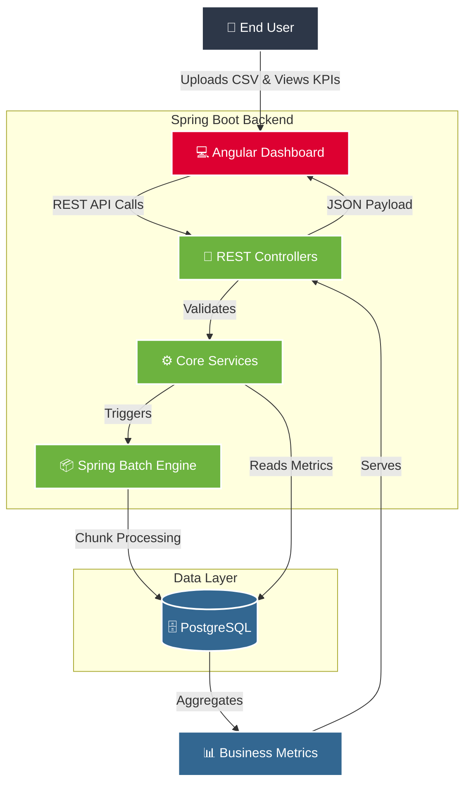
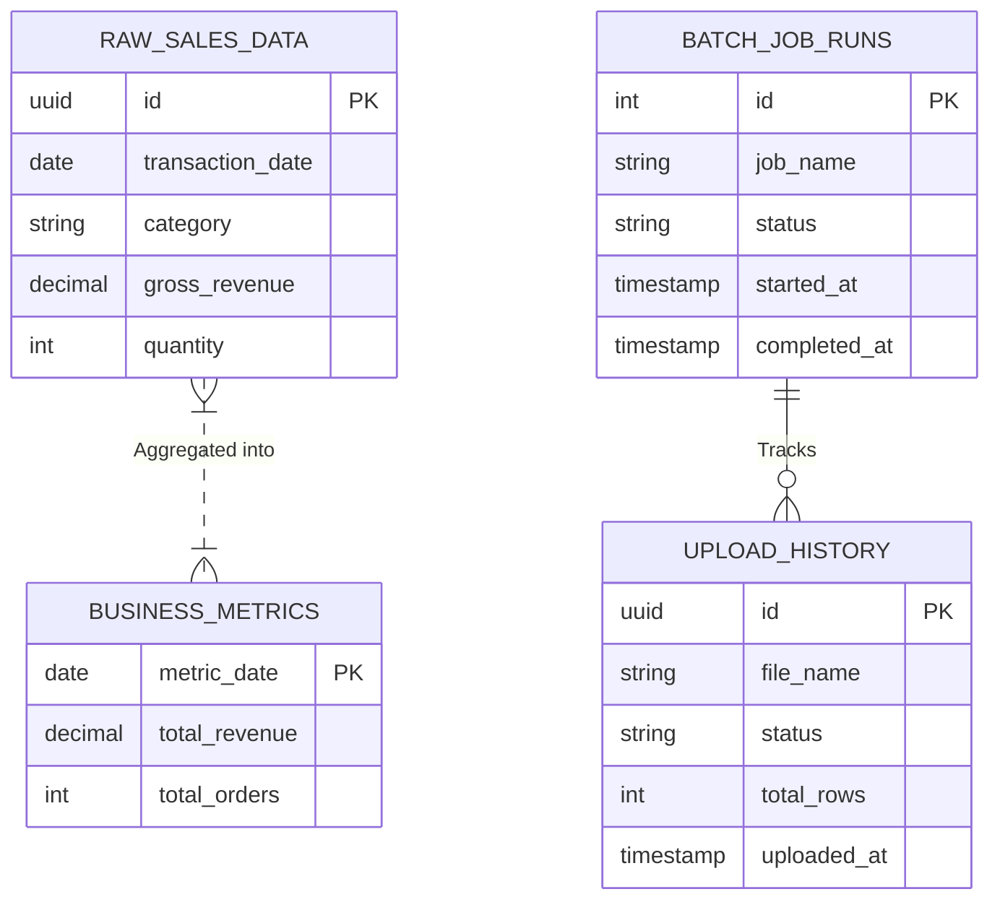

<div align="center">
  <h1>🚀 Automated Business Metric Engine</h1>
  <p><strong>A Full-Stack Enterprise Data Pipeline & Analytics Dashboard</strong></p>
</div>

<p align="center">
  
  
  
  
</p>

---

## 📖 Overview

The **Automated Business Metric Engine** is a highly scalable full-stack application designed for enterprise environments. It provides a robust backend pipeline to ingest massive CSV datasets, process them via **Spring Batch**, calculate business-critical metrics, and serve the results to a stunning, dark/light mode responsive **Angular Dashboard**.

Whether you're processing thousands of rows of sales data or visualizing daily revenue trends, this system provides a secure, efficient, and beautiful interface to monitor your business KPIs.

---

## 🏗️ System Architecture

The application is decoupled into three primary layers: the Angular Client, the Spring Boot Backend API, and the PostgreSQL Database.



---

## 🗄️ Database Schema

The system uses a highly relational PostgreSQL schema to ensure data integrity during batch processing.



---

## ✨ Core Features

- **📊 Dynamic Analytics Dashboard:** Built with Angular 15+ and Chart.js. Features interactive Revenue Trends, Category breakdowns, and Order Volume analysis.
- **⚙️ Enterprise Job Scheduler:** Monitor and control background Spring Batch jobs directly from the UI. Run pipelines on demand.
- **📁 Robust File Ingestion:** Drag-and-drop CSV uploads with real-time success/failure validation and progress tracking.
- **📄 Automated Reporting:** Generate business reports and export them seamlessly to PDF, Excel, and CSV formats.
- **🌗 Seamless Theming:** Polished, premium UI with instantaneous Light and Dark Mode switching using native CSS variables.
- **🛡️ Secure Foundation:** Prepared for Role-Based Access Control (RBAC) with a scalable directory structure.

---

## 🛠️ Technology Stack

| Domain | Technology | Description |
| :--- | :--- | :--- |
| **Frontend** | Angular 15+, SCSS | Modern SPA framework with native CSS variables for theming. |
| **UI/UX** | Angular Material, Chart.js | Enterprise-grade components and interactive canvas charts. |
| **Backend** | Java 17, Spring Boot 3 | Highly concurrent RESTful API and core business logic. |
| **Pipeline** | Spring Batch | Fault-tolerant data ingestion and chunk-oriented processing. |
| **Database** | PostgreSQL, Spring Data JPA | Relational data persistence and complex aggregations. |

---

## 🚀 Local Setup & Installation

Follow these instructions to run the full-stack application on your local machine.

### Prerequisites
- **Java 17+** (Required for Spring Boot 3)
- **Node.js 18+** (Required for Angular CLI)
- **PostgreSQL** (Running locally or via Docker)

### 1. Database Configuration
Create a PostgreSQL database for the application:
```sql
CREATE DATABASE metric_engine;
```
Ensure your `src/main/resources/application.properties` matches your local database credentials:
```properties
spring.datasource.url=jdbc:postgresql://localhost:5432/metric_engine
spring.datasource.username=postgres
spring.datasource.password=your_password
```

### 2. Run the Spring Boot Backend
Open a terminal in the root directory and use the Maven wrapper to start the server:

**Windows:**
```cmd
mvnw.cmd spring-boot:run
```
**Mac/Linux:**
```bash
./mvnw spring-boot:run
```
*The backend API will now be running at `http://localhost:8080`.*

### 3. Run the Angular Frontend
Open a **new** terminal, navigate to the `frontend` folder, install dependencies, and start the development server:

```bash
cd frontend
npm install
npm run start
```
*The Dashboard will be accessible at `http://localhost:4200`.*

---

<div align="center">
  <p>Built with ❤️ for Enterprise Data Pipelines.</p>
</div>
